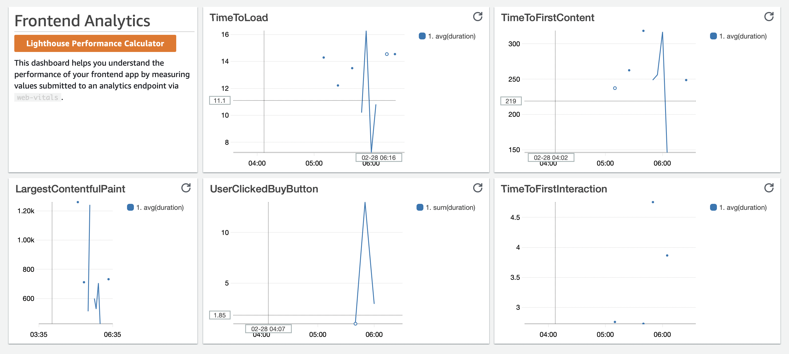

# cloudwatch-web-analytics

This is an example of how to track web analytics and performance using:

-   React
-   Web-Vitals
-   AWS ApiGateway
-   AWS Lambda
-   AWS Cloudwatch Dashboards

The result is the following:

